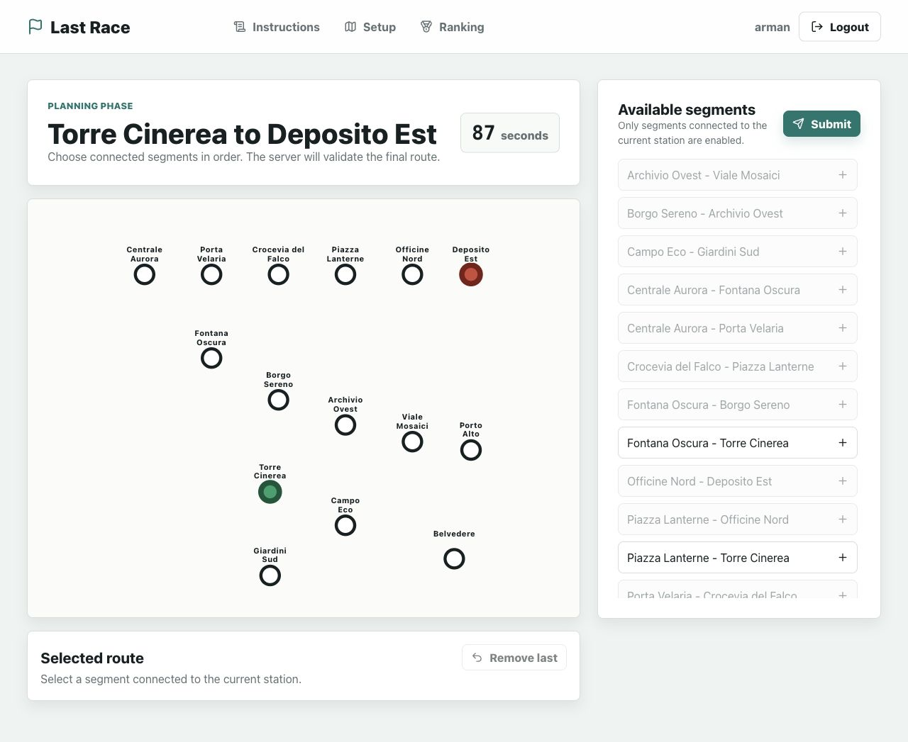
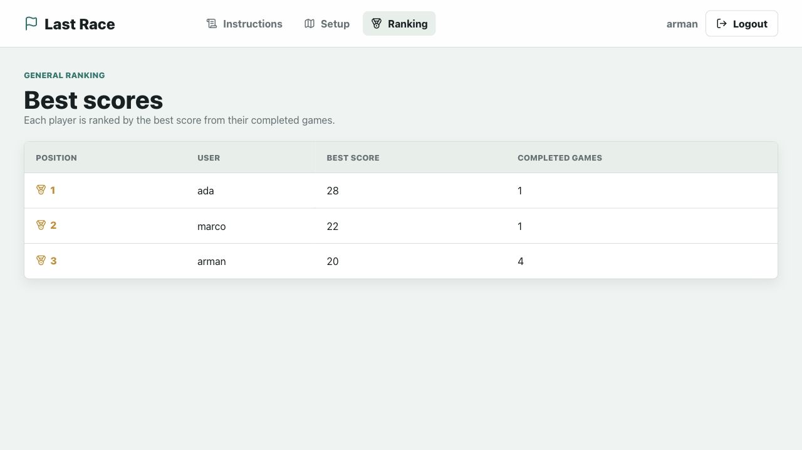

# Exam #1: "Last Race"
## Student: Arman Homafar

## How to Run

Server:
```sh
cd server
npm install
nodemon index.js
```

Client:
```sh
cd client
npm install
npm run dev
```

The server creates and seeds `server/last-race.sqlite` automatically at startup if the database is missing or empty.

## React Client Application Routes

- `/`: public instructions page. Anonymous users can only access this content.
- `/login`: login form for seeded users; no registration is provided.
- `/setup`: protected setup phase with the complete network map, stations, segments, and line legend.
- `/game/:gameId/planning`: protected planning phase with 90-second timer, station-only map, assigned route endpoints, segment list, and selected route.
- `/game/:gameId/execution`: protected execution/result page showing route validity, score, and step-by-step random events for valid routes.
- `/ranking`: protected general ranking with the best score for each registered user.
- `*`: simple not-found page.

## API Server

- `GET /api/instructions`: public instructions object with title and short rules text.
- `POST /api/sessions`: login with `{ username, password }`; returns `{ id, username }` and sets a session cookie.
- `GET /api/sessions/current`: returns the current logged-in user, or `401` if anonymous.
- `DELETE /api/sessions/current`: logs out the current user and clears the server-side session.
- `GET /api/network/full`: protected; returns stations, lines, and segments with line colors for setup.
- `POST /api/games`: protected; creates a game with random reachable start/destination at least 3 segments apart. Returns planning data without line metadata.
- `POST /api/games/:id/submit`: protected owner-only route submission with `{ segmentIds: number[] }`; validates, executes valid routes, stores steps, and returns the result.
- `GET /api/games/:id`: protected owner-only game details/result. Pending games include planning data; submitted games include stored steps.
- `GET /api/ranking`: protected ranking with each user's best completed score and number of completed games.

## Database Tables

- `users`: registered users with unique username plus salted password hash.
- `stations`: fixed underground stations with unique names and map coordinates.
- `lines`: fixed metro lines with unique names and display colors.
- `line_stations`: ordered station membership for each line.
- `segments`: unique undirected station-to-station connections.
- `segment_lines`: many-to-many relation between segments and lines, allowing shared segments.
- `events`: random event descriptions and integer coin effects from `-4` to `+4`.
- `games`: one game per user attempt, including assigned endpoints, score, validity, and timestamp.
- `game_steps`: executed route steps with station pair, chosen line, event, and coin totals.

## Server Database Files

- `server/db.js`: small public export file used by `index.js`.
- `server/db/connection.js`: opens SQLite and enables foreign keys.
- `server/db/schema.js`: creates the database tables.
- `server/db/seed.js`: inserts users, network data, events, and seeded completed games.
- `server/db/helpers.js`: user lookups, network APIs, game creation, validation, execution, and ranking.
- `server/db/passwords.js`: password hashing and password verification.

## Main React Components

- `App`: top-level routes and authenticated layout.
- `AuthProvider` / `useAuth`: session loading, login, logout, and current-user state.
- `NavigationBar`: public/protected navigation and logout control.
- `ProtectedRoute`: redirects anonymous users away from protected pages.
- `PageHeader`: reusable page title area with an optional action.
- `PhaseBadge`: small label for setup, planning, execution, and ranking states.
- `GameButton`: shared button/link styling for game actions.
- `NetworkMap`: SVG map for setup and station-only planning views.
- `StationNode`: draws one station circle and label inside the SVG map.
- `SegmentList`: planning-phase list of selectable unused connected segments.
- `SegmentItem`: one selectable segment row.
- `SelectedRoute`: ordered route display and remove-last control.
- `SelectedRouteItem`: one selected route step.
- `TimerBox`: 90-second countdown display.
- `ResultCard`: final route status, score, and result actions.
- `ExecutionStepCard`: one executed movement, event, and coin update.
- `StepViewer`: reveals valid-route execution events one step at a time.
- `RankingTable` / `RankingRow`: ranking table and one ranking record.
- `InstructionsPage`: public rules and game summary.
- `LoginPage`: seeded-user login form.
- `SetupPage`: full map and start-planning action.
- `PlanningPage`: timer, route building, and route submission.
- `ExecutionPage`: final score and step-by-step event reveal.
- `RankingPage`: best score per user.
- `NotFoundPage`: fallback route.

## Screenshots

### Game Planning


### Ranking


## Users Credentials

- `arman`, password `last-race`
- `ada`, password `metro2026`
- `marco`, password `rails2026`

The seeded database includes successful completed games for `ada` and `marco`.

## Design Notes

- The server is authoritative for game creation, route validation, line-change rules, event selection, scoring, and game ownership.
- The planning API intentionally omits line information so the player sees station names and segment pairs only.
- Route validation accepts repeated stations, rejects repeated segments, reconstructs the path from the assigned start, and tries simple line choices so line changes happen only at interchange stations.
- Final score is stored as `max(final coins, 0)`, and invalid or incomplete routes skip execution and score zero.
- The visual design uses CSS variables, gradients, shadows, and small CSS-only animations. No animation library is needed, so the UI remains easy to explain.
- The planning map draws the currently selected route segments immediately, using the same selected segment list submitted to the server.

## Oral Exam Study Notes

- Authentication is handled by Passport local strategy. After login, the browser keeps a session cookie and protected APIs check `req.isAuthenticated()`.
- The database is seeded at server startup if empty. The schema is normalized: lines, stations, segments, events, games, and game steps are separate tables.
- The frontend uses only React Router, context for the current user, and local `useState` / `useEffect` for page state.
- Planning stores only the ordered selected segment ids. The server reloads the real network from SQLite and validates everything again.
- Execution randomly selects one event per valid segment, updates coins step by step, stores each step, and saves the final non-negative score.

## Use of AI Tools

AI/Codex was used for code assistance, project structure, debugging, validation checks, screenshot capture, and documentation drafting. The generated output was manually reviewed, adapted to the official PDF requirements, tested through API calls and browser navigation, and corrected where verification exposed issues.
